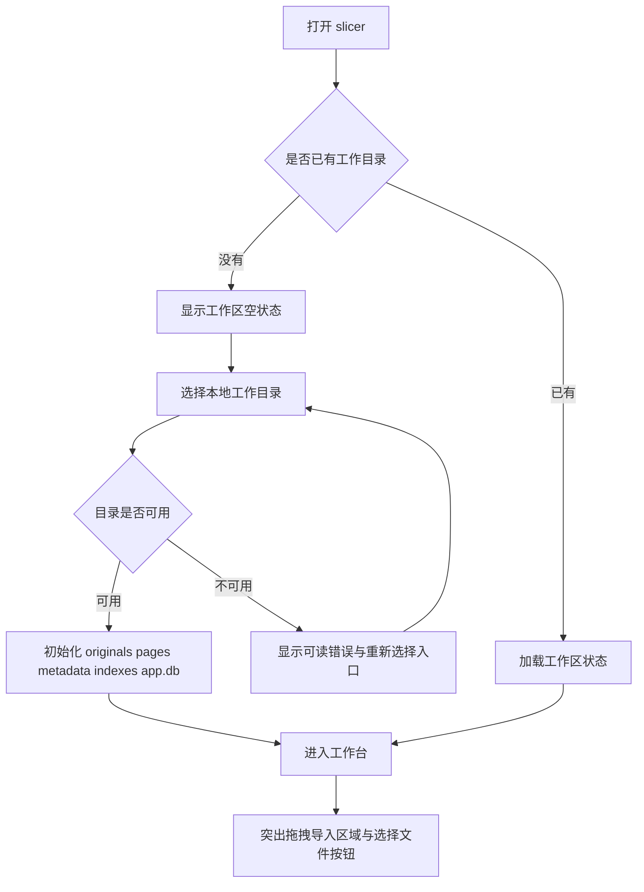
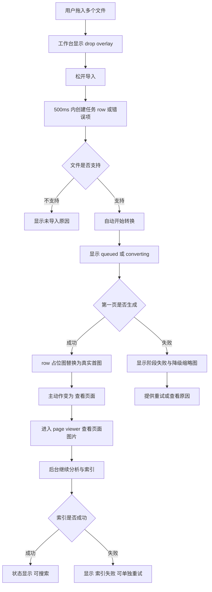
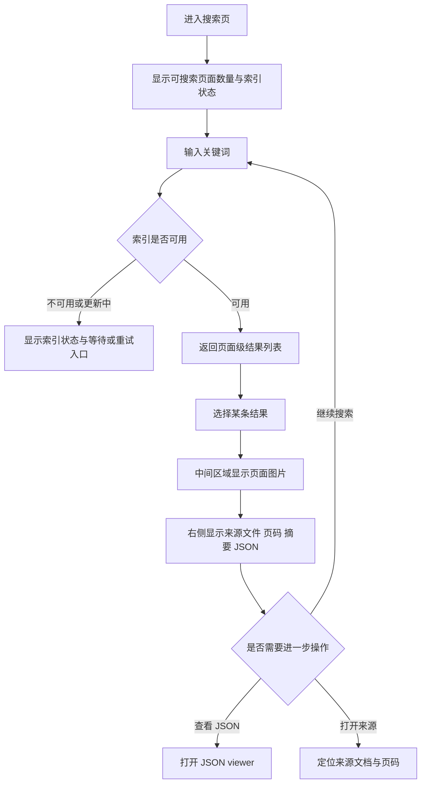
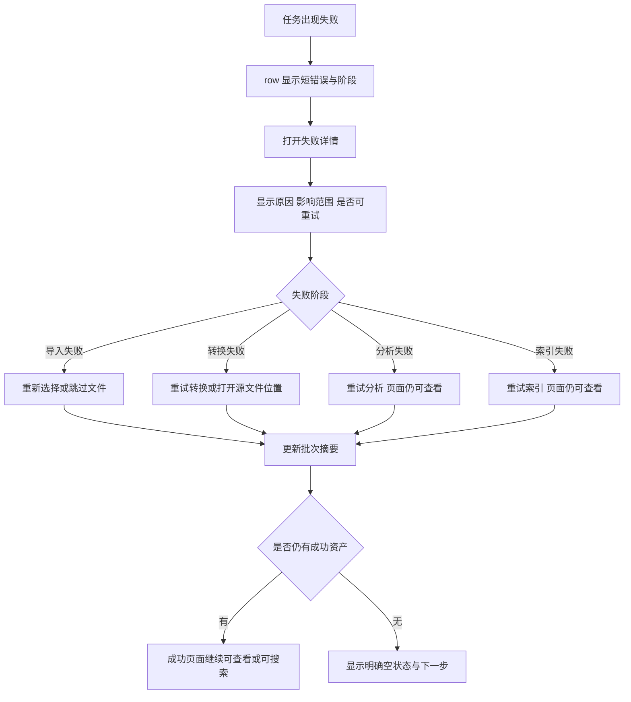

---
stepsCompleted:
  - 1
  - 2
  - 3
  - 4
  - 5
  - 6
  - 7
  - 8
  - 9
  - 10
  - 11
  - 12
  - 13
  - 14
inputDocuments:
  - "D:/AIProject/slicer/_bmad-output/planning-artifacts/prd.md"
  - "D:/AIProject/slicer/_bmad-output/planning-artifacts/architecture.md"
  - "D:/AIProject/slicer/_bmad-output/planning-artifacts/epics.md"
  - "D:/AIProject/slicer/_bmad-output/planning-artifacts/implementation-readiness-report-2026-06-09.md"
  - "D:/AIProject/slicer/docs/index.md"
  - "D:/AIProject/slicer/docs/project-overview.md"
  - "D:/AIProject/slicer/docs/api-contracts.md"
  - "D:/AIProject/slicer/docs/architecture.md"
  - "D:/AIProject/slicer/docs/component-inventory.md"
  - "D:/AIProject/slicer/docs/data-models.md"
  - "D:/AIProject/slicer/docs/deployment-guide.md"
  - "D:/AIProject/slicer/docs/development-guide.md"
  - "D:/AIProject/slicer/docs/source-tree-analysis.md"
  - "D:/AIProject/slicer/docs/project-scan-report.json"
workflowType: "ux-design"
project_name: "slicer"
user_name: "xq"
date: "2026-06-09"
status: "complete"
lastStep: 14
completedAt: "2026-06-09T17:04:57.3657932+08:00"
documentCounts:
  prd: 1
  productBriefs: 0
  research: 0
  projectDocs: 13
  projectContext: 0
---

# UX 设计规格 - slicer

**作者:** xq
**日期:** 2026-06-09

---

<!-- UX design content will be appended sequentially through collaborative workflow steps -->

## Executive Summary

### Project Vision

slicer 是一个 Windows 优先、本地优先的桌面级文档页面切片与多模态检索工具。它将 PDF、PPT/PPTX、DOC/DOCX 等资料转换为页面级图片资产，通过多模态模型生成结构化 `page_analysis_v1` JSON，并在本地建立可追溯的检索能力。UX 目标是让用户以稳定、清晰、可恢复的方式完成从导入、转换、分析、索引到搜索的完整闭环。

### Target Users

核心用户包括本地知识库维护者、研究人员与学生、企业资料整理者，以及需要通过 localhost API 接入页面 JSON 和图片路径的开发者或自动化用户。不同用户的技术熟练度不同，因此主流程必须对非开发者友好，同时为高级用户保留 JSON 查看、纠错、索引重建和 API 配置等能力。

### Key Design Challenges

slicer 的 UX 难点在于把复杂的后台流水线转化为可理解、可操作、可恢复的桌面工作流。应用需要清晰呈现工作目录、外部依赖、模型配置、转换状态、分析状态、索引状态、失败原因和重试入口。搜索体验也不能停留在文本结果列表，而必须同时呈现页面图片、结构化 JSON、来源文档、页码和相关性信息。隐私与安全相关的模型 API key、云端模型调用、localhost API token 等内容需要被明确表达，但不能压垮主流程。

### Design Opportunities

优秀的 UX 可以让 slicer 从“技术流水线”变成可信赖的桌面工作台。工作台可以通过任务列表、状态徽标、进度反馈和批量重试建立掌控感；搜索页可以通过结果列表、页面预览和 JSON/来源详情的组合，让页面级知识资产的价值被用户立刻理解；设置页可以用克制、分组明确的布局处理工作目录、LibreOffice、模型、隐私和本地 API。失败恢复、索引重建和隐私提示如果设计得足够清楚，会成为产品可靠性的核心体验。

## Core User Experience

### Defining Experience

slicer 的核心体验不是让用户执行一串技术步骤，而是让用户确信：一批本地文档已经被可靠地转化为可看见、可追溯、可搜索的页面级知识资产。

在当前阶段，项目已经完成 MVP 版本迭代，因此 UX 设计重点不是推翻已有流程，而是围绕现有 MVP 做视觉美化、交互优化和状态表达增强。界面应帮助用户更清楚地理解：文件是否被系统接住、页面是否已经生成、分析是否完成、索引是否可用、失败是否可恢复，以及下一步可以做什么。

用户最常做的动作是批量导入并处理文档，但这个动作背后的真正目标是资产就绪。用户不是为了看见“导入、转换、分析、索引”这些内部阶段而使用 slicer，而是为了让原本难以检索和引用的资料变成可以查看页面图、追溯来源、搜索命中并查看 JSON 的资料资产。

页面图片是 slicer 的第一价值证明。当用户第一次看到原始文档被拆解成清晰页面图时，就完成了从“我上传了文件”到“这些资料已经变成资产”的认知转变。因此 UI 美化和交互优化应优先服务页面图片出现前后的体验：导入反馈、转换进度、页面预览、来源页码、失败定位和批量任务完成感。

### Platform Strategy

slicer 的主平台是 Windows 桌面应用，交互方式以鼠标和键盘为主。界面应遵循桌面工具的使用习惯：清晰导航、稳定布局、明确按钮、可扫描表格、可定位错误、可恢复任务和高信息密度。它不应呈现为营销页、轻量玩具工具或移动优先体验。

由于产品是本地优先工具，工作目录、导入文件、页面图片、任务状态、JSON 和索引都应围绕本地工作区展开。离线能力应覆盖工作区浏览、页面图片查看、已有 JSON 查看和已有索引搜索；多模态分析依赖用户配置的模型服务，因此模型不可用时应清楚提示，但不应阻断用户查看已生成的页面图片和已有结果。

开发者和自动化用户仍然重要，但在 UI 优化阶段，主体验应优先服务桌面用户的批量处理、状态确认、失败恢复和搜索查看。localhost API、JSON 编辑、提示词纠错等高级能力应作为清晰但不过度干扰的增强入口存在。

### Effortless Interactions

最需要变得自然、顺手、低思考负担的交互是批量导入与转换。用户拖入或选择多个文档后，应能立即看到文件被接收、类型被识别、任务被创建、转换进度开始推进。导入/转换是整条价值链的基础，一旦这里失败或反馈不清，后续分析、索引和搜索都无法建立信任。

转换完成后，页面图片应成为界面的主要反馈物。用户不需要先理解 JSON、索引或模型 schema，就能通过页面预览确认“文档已经被拆出来了”。页面图片的出现应尽量快、清楚、可打开、可定位来源文档和页码。

界面可以展示导入、转换、分析、索引等阶段，但用户真正关心的是资产是否已经可用。因此状态表达应尽量从技术流水线语言转向资产就绪语言，例如“已生成页面”“可分析”“可搜索”“需要重试”“索引更新中”。技术阶段仍然保留给诊断和高级用户，但主界面应帮助普通用户判断下一步能做什么。

分析完成后应自动触发索引构建或索引更新，避免用户在“已经分析完却还搜不到”的状态中困惑。索引如果正在构建、构建失败或需要重建，界面应明确展示状态，而不是让用户通过搜索失败来反推原因。

失败恢复也应尽量轻量：用户应该能直接看到失败发生在导入、转换、分析还是索引阶段，看到可读的失败摘要，并能对单个任务或全部失败项执行重试。错误状态不应只出现在日志或隐藏诊断区域中。

### Critical Success Moments

第一个关键成功时刻是用户首次看到文档被转换后的页面图片。这一刻决定用户是否相信 slicer 能把本地资料转化为可处理的页面资产，因此页面图片预览、来源信息、页码和转换状态必须清晰可靠。

第二个关键成功时刻是批量导入/转换稳定完成。导入和转换最不能失败，因为它们是所有后续能力的入口。即使某些文件因为格式、LibreOffice、路径或权限问题失败，失败也必须是可理解、可恢复、可重试的。

第三个关键成功时刻是分析完成后自动进入可搜索状态。用户不应需要理解“索引构建”这个内部概念才能得到搜索结果。系统可以展示索引状态，但默认体验应尽量让分析后的页面自然进入搜索能力。

第四个关键成功时刻是搜索结果能同时展示页面图片、来源文档、页码、摘要和 JSON。用户搜索命中后，应能快速确认“这是不是我要找的那一页”，并在需要时进一步查看结构化 JSON 或来源信息。

第五个关键成功时刻是失败后的恢复体验。如果转换失败、分析失败或索引失败，用户能否快速理解原因并重新尝试，会直接影响产品的可信度和成熟感。

### Experience Principles

1. 页面图片是第一价值证明，不只是转换产物。
2. 批量处理的目标是资产就绪，而不是流程跑完。
3. 导入/转换可靠感决定用户是否信任后续能力。
4. 分析后的默认结果应该是可搜索，而不是等待用户手动建索引。
5. 状态语言应优先回答“现在能做什么”，其次才解释“系统正在做什么”。
6. UI 美化应提高信任、扫描效率和操作确定性，而不是增加装饰复杂度。
7. 高级能力应围绕资产诊断和修正展开，不应打断批量处理主线。

## Desired Emotional Response

### Primary Emotional Goals

slicer 的主要情绪目标是让用户感到简洁、轻松和高效。它应该像一款现代干净的生产力软件：界面清楚、操作直接、反馈及时，不让批量文档处理显得笨重、混乱或技术门槛很高。

用户在使用 slicer 时，应感到自己可以快速把一批资料交给系统处理，并且能轻松理解系统当前状态。产品不需要制造强烈的惊喜感，而应持续传递“这件事比我想象得简单”“系统在稳妥推进”“我可以很快得到可用结果”的感受。

### Emotional Journey Mapping

首次进入应用时，用户应感到界面干净、目的明确，不需要先读大量说明才能开始。工作台应直接展示当前工作目录、导入入口、任务状态和主要操作，让用户知道从哪里开始。

导入和转换过程中，用户应感到轻松和高效。文件被接收、任务被创建、转换进度推进、页面图片逐步出现，这些反馈应让用户觉得系统响应很快，而不是在黑盒中等待。

第一次看到页面图片时，目标情绪是“这很快”。页面图片的出现代表资料已经从原始文档变成可见的页面资产，因此这一刻应被设计得清晰、即时、有确认感。

分析和索引阶段，用户应感到系统在自动完成后续工作。分析完成后自动建索引，可以减少用户对内部流程的理解成本，让用户自然进入“资料已经可以搜索”的状态。

搜索命中时，用户应感到资料变得有序、以后找东西更轻松。结果列表、页面预览、来源文档、页码、摘要和 JSON 应共同支持这种“可找回、可确认、可长期使用”的感受。

当出现失败时，界面应把用户从焦虑拉回可控状态。失败反馈必须避免让用户不知道错在哪、害怕数据丢失、觉得工具不可靠、怀疑自己操作错了，或找不到重试入口。

完成一次批量处理并进入可搜索状态后，用户应获得任务完成感、资料有序感和长期信任感。理想反应是：这批资料已经被整理好了，以后找东西会更轻松，这个系统值得持续使用。

### Micro-Emotions

关键正向微情绪包括：

1. 清爽：界面结构干净，视觉层次明确，没有多余装饰干扰。
2. 轻松：用户不需要理解所有技术细节，也能完成导入、转换、分析和搜索。
3. 快速：文件进入任务、转换开始、页面图片出现和搜索反馈都应有及时响应。
4. 掌控：用户能随时看到每个任务的状态、进度、失败原因和下一步操作。
5. 安心：本地工作目录、页面图片、JSON 和索引状态都被清楚呈现，失败不意味着数据丢失。
6. 有序：批量文档经过处理后变成可浏览、可搜索、可追溯的页面资产。
7. 信任：长期任务、失败恢复、自动索引和稳定搜索让用户愿意反复使用。

需要避免的负向微情绪包括：

1. 困惑：不知道文件是否被接收、任务是否开始、处理卡在哪一步。
2. 焦虑：担心原始文件、页面图片或已有 JSON 因失败而丢失。
3. 自责：用户误以为失败是自己操作错了。
4. 不信任：状态反馈含糊、失败原因不可见、重试入口难找。
5. 负担感：用户被迫理解太多内部流程或重复触发本应自动发生的操作。
6. 等待疲劳：长任务没有进度、没有阶段反馈、没有局部完成感。

### Design Implications

为了营造简洁、轻松和高效的情绪体验，UI 应采用现代干净的生产力软件风格。视觉层次应克制，优先使用清晰的布局、稳定的间距、明确的状态徽标、可扫描的任务列表和可靠的预览区域。美化应服务效率和信任，而不是增加装饰复杂度。

为了强化“这很快”的第一印象，页面图片生成后的反馈应尽可能直接。工作台应突出页面图片已经生成的状态，让用户能快速预览、打开或定位来源页。即使后续分析尚未完成，用户也应能明确看到转换已经产生了可见成果。

为了避免失败带来的焦虑，错误状态必须结构化呈现。每个失败都应说明发生阶段、可读原因、影响范围、是否可重试和重试入口。界面文案应避免暗示用户操作错误，除非确实需要用户修正配置或输入。

为了建立长期信任，系统应清楚区分“原始文件仍在”“页面图片已生成”“JSON 已存在”“索引正在更新”“可搜索”等状态。用户应该明白失败不会轻易破坏已有资产，也不会让已完成的结果消失。

为了降低负担感，分析后自动建索引应成为默认体验。用户可以看到索引状态，但不需要手动理解或触发每一次索引更新。主界面应回答“现在能做什么”，高级诊断再解释“系统内部发生了什么”。

### Emotional Design Principles

1. 简洁不是信息少，而是信息层次清楚。
2. 轻松来自明确反馈、自动衔接和少走弯路。
3. 高效感来自快速可见的页面图片和稳定推进的任务状态。
4. 失败体验必须保护用户信心，先说明发生了什么，再提供恢复路径。
5. 所有状态表达都应减少用户猜测，尤其是导入、转换、分析、索引和搜索可用性。
6. 现代生产力软件气质应体现为干净、克制、稳定、可扫描，而不是视觉噱头。
7. 长期信任来自资产安全感：原始文件、页面图片、JSON 和索引状态都应可理解、可恢复、可追溯。

## UX Pattern Analysis & Inspiration

### Inspiring Products Analysis

#### Obsidian

Obsidian 的可借鉴之处在于它把本地资料组织成一个持续可用的知识工作区，而不是一次性工具。它的界面气质克制、干净、偏生产力，用户可以通过侧边栏、搜索、文档列表和内容区快速进入工作状态。对 slicer 来说，Obsidian 的启发不是复杂插件生态，而是“本地资料库 + 清晰导航 + 快速搜索 + 安静工作区”的整体感觉。

Obsidian 的搜索体验也值得借鉴：搜索不是孤立功能，而是资料工作流的一部分。用户搜索后能快速看到候选结果、定位内容，并继续浏览上下文。slicer 的搜索结果也应让用户快速判断命中页面是否有用，并能自然进入页面图片、来源文档、页码和 JSON 详情。

#### Dropbox

Dropbox 的可借鉴之处在于它把文件处理、上传、同步、完成状态和错误反馈做得相对轻量、清楚。用户不需要理解底层机制，也能知道文件是否被接收、是否处理中、是否完成、哪里出了问题。对 slicer 来说，Dropbox 的启发主要在批量导入、任务状态、资产就绪和失败恢复上。

Dropbox 的视觉风格也符合 slicer 的目标：现代、干净、轻量，不强调开发者语境，也不把界面做成复杂后台。slicer 可以借鉴这种“文件资产正在被处理并逐步变得可用”的反馈方式，让用户在导入、转换、分析和索引过程中持续感到轻松和高效。

### Transferable UX Patterns

#### 现代干净视觉风格

slicer 应采用现代干净的生产力软件风格：浅色优先、层次克制、清晰留白、稳定布局、明确状态色和简洁图标。视觉美化应提升扫描效率和信任感，而不是制造装饰性复杂度。界面应避免强烈技术感和后台管理系统感，让用户觉得它是一个面向资料处理的现代桌面工具。

#### 工作台布局

可以借鉴 Obsidian 的工作区思路和 Dropbox 的文件处理反馈，将 slicer 的主界面设计为清晰的工作台：导航区域承载工作台、搜索、设置等主入口；主区域承载批量导入、任务列表、处理状态和页面资产预览；详情区域用于展示选中文档或页面的来源、页码、状态、错误和可执行操作。

工作台应优先回答三个问题：当前有哪些资料、它们处理到哪一步、现在用户可以做什么。它不应像后台 dashboard 一样堆满统计卡片，也不应像开发 IDE 一样强调技术结构。

#### 搜索结果体验

搜索体验可以借鉴 Obsidian 的快速定位感，但输出更适合 slicer 的页面级资产模型。搜索结果应以“页面”为核心，而不是纯文本片段。每条结果应展示标题或摘要、来源文档、页码、相关分数和状态，并支持快速查看页面图片与 JSON。

搜索页适合采用结果列表 + 页面预览 + 详情/JSON 的布局。用户搜索后应能立刻判断命中结果是否正确，而不需要打开多个窗口或离开搜索上下文。

#### 状态与动效反馈

可以借鉴 Dropbox 的轻量状态反馈：文件被接收、正在处理、已完成、失败、可重试等状态应清楚而不打扰。动效应服务状态变化，例如导入接收、任务进入队列、页面图片生成、索引更新完成。动效应短、克制、可感知，不应拖慢任务处理或造成花哨感。

### Anti-Patterns to Avoid

1. 避免太像开发工具。JSON、API、日志和诊断能力很重要，但不应成为主界面的视觉中心。
2. 避免太像后台管理系统。不要用大量统计卡片、复杂筛选器和管理面板压过“导入、处理、查看、搜索”的主线。
3. 避免过度技术化状态语言。主界面应优先使用用户能理解的状态，如“已生成页面”“可搜索”“需要重试”，而不是只显示内部任务名。
4. 避免纯表格化体验。任务列表需要可扫描，但页面图片预览和资产确认同样关键。
5. 避免卡片堆叠式装饰。slicer 是生产力工具，不需要大量浮动卡片、营销式 hero 或过度渐变背景。
6. 避免搜索结果只返回文本。slicer 的核心价值是页面级可追溯结果，因此搜索必须连接页面图片、来源和 JSON。
7. 避免失败状态隐藏在日志里。失败原因、影响范围和重试入口必须在任务上下文中可见。

### Design Inspiration Strategy

#### What to Adopt

采用 Obsidian 式的安静知识工作区感：清晰导航、稳定主区域、快速搜索、低干扰视觉层次。它支持 slicer 的本地资料库定位，也符合用户希望“资料变有序”的情绪目标。

采用 Dropbox 式的文件处理反馈：导入、处理中、完成、失败、重试等状态应轻量而明确。它支持 slicer 的批量导入/转换可靠感，也能减少用户对数据丢失和操作错误的焦虑。

#### What to Adapt

将 Obsidian 的搜索定位体验改造成页面级搜索体验。slicer 的结果不应只定位文本，而应定位页面资产，并展示图片、页码、来源文档、摘要、相关分数和 JSON。

将 Dropbox 的文件状态反馈扩展为多阶段资产就绪反馈。slicer 的状态不仅是“文件同步完成”，而是“页面已生成”“分析完成”“索引更新中”“可搜索”“需要重试”等更符合产品流程的状态。

#### What to Avoid

避免采用开发工具式界面结构。即使 slicer 有 JSON 编辑、localhost API 和诊断信息，也应把它们设计为高级入口，而不是让普通用户一打开应用就感到技术压力。

避免采用后台管理系统式视觉。slicer 的主界面不应像运营仪表盘，而应像资料处理工作台：直接、清楚、轻量、可操作。

## Design System Foundation

### 1.1 Design System Choice

slicer 采用轻量自定义设计系统作为 UI 美化和交互优化的基础，而不是引入大型成套组件库。当前项目已经完成 MVP，并且前端基于 React + TypeScript + Tauri 构建，已有 `Button`、`StatusBadge`、`ErrorMessage`、`EmptyState` 等基础通用组件。因此设计系统应在现有实现之上演进，通过统一 design tokens、组件规范和页面模式来提升一致性。

该设计系统应服务“现代干净的生产力软件”气质，整体接近 Obsidian 的本地知识工作区感和 Dropbox 的文件处理反馈感。它应避免 Ant Design 或传统后台系统式视觉，也不应变成偏开发工具的复杂界面。

### Rationale for Selection

选择轻量自定义设计系统的原因如下：

1. 项目已经完成 MVP，当前重点是美化和交互优化，而不是重新搭建 UI 技术栈。
2. slicer 需要现代、干净、轻松、高效的桌面生产力软件气质，大型企业组件库容易带来后台管理系统感。
3. 产品核心界面包括工作台、任务列表、页面预览、搜索结果、JSON 详情和设置页，需要高度贴合页面级资产处理流程。
4. 现有组件基础可以继续扩展，减少迁移成本和视觉断层。
5. 轻量自定义方案能更好地控制状态表达、失败恢复、页面图片预览和资产就绪语言。
6. React/Tauri 桌面场景不需要完整企业 Web 控件体系，优先需要稳定布局、清晰状态、快捷操作和高质量空/错/加载状态。

### Implementation Approach

设计系统应从以下层级落地：

1. Design tokens  
   定义颜色、字体、字号、行高、间距、边框、圆角、阴影、状态色、焦点环和动效时长。tokens 应集中维护，避免不同页面自行定义视觉规则。

2. Common primitives  
   在现有 `components/common` 基础上继续完善通用组件，包括 Button、IconButton、StatusBadge、ProgressBar、EmptyState、ErrorMessage、Toolbar、Tabs、SegmentedControl、Dialog、Tooltip、Input、Select、Switch、Checkbox 和 InlineAlert。

3. Feature patterns  
   为 slicer 的关键场景定义可复用模式：批量任务列表、导入区域、页面预览面板、搜索结果列表、JSON 查看/编辑区域、设置分组、失败详情和重试操作。

4. Page layouts  
   建立稳定的页面布局规范，包括应用壳、侧边导航或顶部导航、工作台主区域、详情面板、搜索三栏布局和设置页分组布局。布局应优先服务扫描效率和桌面工具稳定感。

5. State language  
   把设计系统扩展到状态文案和状态视觉。状态不只是颜色和徽标，还包括“已生成页面”“可分析”“索引更新中”“可搜索”“需要重试”等用户可理解的资产就绪语言。

### Customization Strategy

视觉定制应围绕现代干净生产力软件展开：

1. 色彩  
   采用浅色优先的中性色基底，搭配少量清晰的状态色。避免大面积深色、强渐变、装饰性背景和过度饱和色。状态色应区分处理中、成功、警告、失败、不可用和需要重试。

2. 字体与密度  
   使用适合桌面工具的字号层级和信息密度。任务列表、搜索结果和设置项应可快速扫描；页面标题和分组标题不应过大，避免营销页气质。

3. 圆角与阴影  
   使用克制的圆角和轻量边框。卡片只用于必要的 repeated item、面板或弹层，不应让整个页面变成卡片堆叠。阴影应少用，优先用边框、背景层次和间距建立结构。

4. 图标与操作  
   常见操作应使用清晰图标和简洁文字组合。导入、重试、刷新、搜索、设置、打开、复制、查看 JSON、重建索引等操作应有一致图标语言，并提供 tooltip。

5. 动效  
   动效应服务反馈，不服务装饰。适合使用在文件接收、任务状态变化、页面图片生成、索引更新完成、错误展开等场景。动效时长应短、克制、可感知。

6. 可访问性  
   组件应支持键盘焦点、足够对比度、明确 disabled/loading 状态和可读错误信息。状态不能只靠颜色表达，必须同时通过文案、图标或结构体现。

7. 避免风格  
   避免太像开发工具，避免太像后台管理系统，避免营销式 hero，避免复杂仪表盘，避免大量浮动卡片和装饰性渐变。

## 2. Core User Experience

### 2.1 Defining Experience

slicer 的定义性体验是：用户把一批本地文档拖入工作台，系统立即接住这些文件，自动开始转换，并快速把它们显影为可预览、可追溯、可搜索的页面级资产。

这不是一个以任务队列为主角的后台处理体验，而是一个以页面资产为主角的现代资料工作台体验。任务列表只是过渡层，真正的产品时刻是用户看到第一页真实缩略图，点进去看到页面图片，并最终能搜索命中具体页面、追溯回来源文档和页码。

主入口是拖拽导入和点击选择文件并重，但视觉上拖拽更突出。文件按钮是备用入口，但必须与拖拽走同一导入流程。用户拖入文件后，工作台应立即进入接收态；松开后系统快速创建任务并自动开始转换。

转换完成后，任务行中的文件类型占位图应替换为真实第一页缩略图。缩略图不是装饰，而是信任证据：它告诉用户文件确实被解析成页面，且页面图像可查看。点击缩略图、任务行或主动作都应进入对应文档的页面 viewer。

分析和索引应自动衔接，但不能隐形。用户必须能区分“页面可查看”和“内容可搜索”。只有索引成功的文档和页面才能显示为“可搜索”。索引失败应可单独重试，并且不影响已生成页面图片的查看。

### 2.2 User Mental Model

用户的心智模型是“把文件放进一个资料工作台，系统帮我把它们整理成可以查看和搜索的页面资产”。用户并不天然关心导入、转换、分析、索引之间的技术边界，而是关心文件是否被系统接住、页面是否已经生成、哪些内容可以搜索、失败是否影响已有成果，以及能否追溯回原文件和页码。

用户熟悉的模式包括拖拽上传、文件队列、同步/处理状态、缩略图预览、页面浏览和搜索结果定位。slicer 应组合这些成熟模式，而不是引入需要额外学习的新交互。

用户最容易困惑或失去信任的地方包括：拖入没反馈、转换进度不清楚、看不到页面图片、失败原因不清楚、分析完成后搜不到、界面太乱、任务完成但不知道下一步去哪里。设计必须围绕这些断点建立明确反馈、可见状态和恢复路径。

### 2.3 Success Criteria

核心体验成功的标准包括：

1. 用户拖入文件时，工作台出现明显接收态，提示用户松开即可导入。
2. 用户松开文件后，界面在 500ms 内为每个有效文件创建任务 row，或为无效文件显示明确未导入原因。
3. 文件选择按钮与拖拽导入走同一导入流程，行为和反馈一致。
4. 导入后系统默认自动开始转换，用户不需要额外点击“开始转换”。
5. 任务 row 显示文件名、文件类型或首图、页数或页数探测状态、阶段状态、进度、搜索可用状态和主动作。
6. 任务状态不使用含糊的单一 `processing`，而应至少区分 `importing`、`queued`、`converting`、`converted`、`analyzing`、`analyzed`、`indexing`、`indexed`、`failed_import`、`failed_convert`、`failed_analyze`、`failed_index` 和 `canceled`。
7. 第一页转换成功后，任务 row 的占位图替换为真实第一页缩略图；缩略图加载失败或转换失败时必须有降级态，不能出现空白或破图。
8. 点击缩略图、任务 row 或“查看页面”主动作能进入对应文档的页面 viewer，并默认打开该文档第一页。
9. 转换完成后，页面图片立即可查看，即使分析或索引尚未完成。
10. 分析和索引自动排队执行，但“可搜索”状态只能由索引成功触发，不能由分析完成替代。
11. 分析失败或索引失败不影响已生成页面图片查看。
12. 索引失败应显示清晰状态和重试入口，重试索引不应要求重新转换文档。
13. 批量处理应有轻量批次摘要，展示文件总数、处理中数量、已生成页面数量、失败数量和可搜索数量。
14. 一个任务失败不阻塞同批次其他任务继续处理、查看或进入可搜索状态。
15. 批量转换完成后，界面应把焦点从任务进度转向页面资产浏览，提供“查看页面资产”或“打开最新批次”等明确入口。
16. 页面 viewer 应展示页面图像、页码、来源文件、转换状态、分析状态和索引状态。
17. 搜索结果必须定位到具体页面，并显示来源文件和页码，不应只返回文件级结果。
18. 所有失败状态必须显示阶段、用户可理解的原因、是否可重试和明确动作。
19. 主界面保持现代干净工作台气质，不展示 raw path、job id、worker id 等技术字段作为默认信息。
20. 应用重启后，任务状态、页面资产和索引状态不丢失，前端不得仅依赖临时内存状态判断任务完成。

### 2.4 Novel UX Patterns

slicer 的核心交互主要由成熟模式组合而成，不需要发明全新的交互语言。它使用用户熟悉的拖拽导入、文件处理队列、缩略图预览、状态徽标、页面浏览和搜索定位模式，并将它们组合成页面级资产生成体验。

独特之处在于：用户拖入的不是普通文件，而是一批将被显影为页面资产的本地资料。任务行里的首张缩略图、页面 viewer、搜索可用状态和来源追溯共同构成 slicer 的差异化体验。用户不仅知道“文件处理完了”，还知道“页面生成了、页面能看、内容能搜、结果能追溯”。

设计上应避免把这种组合退化为后台任务表。任务列表应保持轻量、可扫视、可进入；页面资产浏览和搜索可用性应成为处理完成后的主焦点。

### 2.5 Experience Mechanics

#### 1. Initiation

用户打开工作台后，主区域应突出拖拽导入区域，并提供同样清晰但视觉权重略低的“选择文件”按钮。空状态应克制直接，主文案可以表达为“拖入文档，生成可查看、可搜索的页面资产”，次级文案说明支持的文件类型。

当文件拖入窗口时，工作台应出现明显 drop overlay 或接收态。接收态应让用户知道系统已经识别到拖拽行为，并提示“松开以导入”。拖拽离开窗口时，接收态消失。拖拽不应触发浏览器默认打开文件行为。

#### 2. Interaction

用户拖入或选择多个文件后，系统立即创建批次和文件任务。支持的文件进入任务列表，不支持的文件显示明确未导入原因。批量任务按导入顺序显示，一个文件失败不阻塞其他文件继续处理。

导入后系统默认自动开始转换。任务 row 起初显示文件类型占位图、文件名和导入/排队状态。转换过程中显示当前阶段和进度，例如“正在转换页面 3/18”或“正在生成缩略图”。转换出第一页后，占位图替换为真实第一页缩略图。

任务 row 应避免成为复杂后台表格。默认展示的信息应包括首图或占位图、文件名、页数、阶段状态、进度、搜索状态和主动作。路径、内部 job id、worker id、详细日志等技术信息应放在详情或诊断入口。

#### 3. Feedback

反馈分为四类：接收反馈、处理反馈、资产反馈和搜索就绪反馈。

接收反馈回答“系统是否接住了文件”。用户 drop 后应快速看到任务 row 或错误项。

处理反馈回答“系统现在做到了哪一步”。状态应至少覆盖导入、排队、转换、分析、索引和失败阶段。

资产反馈回答“页面是否已经生成并可查看”。第一页缩略图和页面 viewer 是最重要的反馈，不应被隐藏在详情深处。

搜索就绪反馈回答“内容是否已经可搜索”。转换完成不等于可搜索，分析完成也不等于可搜索。只有索引成功后，文档或页面才能显示“可搜索”。

失败反馈必须结构化而不是一次性 toast。失败对象应至少包含阶段、错误代码或类型、用户可读信息、详情、是否可重试。row 上显示短错误，详情面板显示完整原因和恢复动作。典型动作包括重试、跳过、查看原因、打开源文件位置、重新分析或重新索引。

#### 4. Completion

转换完成后，单个任务的主动作应变为“查看页面”，用户可以点击缩略图、任务 row 或主动作进入 page viewer。批量转换完成后，工作台应出现轻量完成摘要，并提供查看页面资产或打开最新批次的入口。

完整资产就绪发生在页面可查看、分析完成且索引成功之后。此时文档或页面状态显示“可搜索”，搜索页可以命中具体页面并回到对应页面 viewer。

如果存在部分失败，完成态应显示“部分完成”而不是简单失败。已成功的页面资产仍可查看和搜索，失败项保留在上下文中，提供阶段级重试和明确原因。

## Visual Design Foundation

### Color System

slicer 不使用既有品牌规范，视觉主题以黑白灰中性色为核心，建立现代干净的生产力软件气质。色彩系统应支持浅色模式和暗色模式，并通过语义化 token 管理，避免页面直接使用散落的硬编码颜色。

浅色模式应以接近白色的应用背景、浅灰页面区域、细边框和深色正文为基础。深浅层级应清楚但克制，用于区分应用壳、工作台区域、任务列表、页面 viewer、详情面板和弹层。整体应接近现代文件/知识工作区，而不是后台 dashboard。

暗色模式应采用中性深灰作为主背景，而不是纯黑。页面层级通过不同深度的灰、细边框和轻微高亮建立。暗色模式的目标是舒适、安静、可长时间使用，不应变成高对比开发工具风格。

主色应保持克制，建议使用低饱和蓝灰或中性蓝作为交互强调色，用于主要按钮、焦点环、选中态、链接和可操作高亮。因为整体主题偏黑白灰，主色应少量使用，避免破坏干净感。

状态色必须清晰但低噪音：

1. 成功 / 可搜索：低饱和绿色，用于 `可搜索`、完成、索引成功。
2. 处理中 / 索引中：中性蓝或蓝灰，用于 `转换中`、`分析中`、`索引更新中`。
3. 警告 / 部分完成：低饱和黄色或琥珀色，用于 `部分失败`、`需要配置`、`索引未就绪`。
4. 错误 / 失败：克制红色，用于 `转换失败`、`分析失败`、`索引失败`。
5. 不可用 / 跳过：中性灰，用于 disabled、canceled、unsupported。

状态不能只依赖颜色表达，必须同时配合图标、文案或结构。例如 `可搜索`、`需要重试`、`索引失败` 都应有清晰文字。

### Typography System

字体采用系统字体优先策略，避免引入额外字体依赖。Windows 桌面环境下优先使用 `Segoe UI`，中文 fallback 使用 `Microsoft YaHei` 或系统默认中文 UI 字体。等宽内容如 JSON viewer、路径片段和诊断详情使用系统 monospace 字体。

字体气质应现代、干净、实用。标题不应过大，避免营销页感。任务列表、搜索结果、设置项和状态文案应可快速扫描。页面中的文字层级服务信息理解，而不是装饰表达。

建议字号层级：

1. 页面标题：20-24px，用于工作台、搜索、设置等主页面标题。
2. 区块标题：15-17px，用于任务列表、页面预览、设置分组。
3. 正文：13-14px，用于说明、列表内容、搜索摘要。
4. 辅助信息：12-13px，用于来源路径、页码、状态说明、时间信息。
5. 状态徽标：12px 左右，短文案、紧凑但可读。
6. JSON / code：12-13px，行高略高，保证长时间阅读和编辑舒适。

行高应偏实用：正文约 1.45-1.6，任务列表和状态信息可更紧凑，但不能让中文挤在一起。字重使用克制，主要依靠字号、颜色和间距建立层级。

### Spacing & Layout Foundation

整体布局采用中等偏紧凑密度，适合 Windows 桌面工具和批量任务处理。界面需要能同时容纳导入入口、任务状态、缩略图、页面预览、搜索可用状态和失败恢复操作，因此不应过度留白，也不应压缩到后台表格感。

间距系统以 8px 为基础单位，配合 4px 做微调：

1. 4px：图标与文字、紧凑状态徽标内部间距。
2. 8px：列表项内部基本间距、按钮间距、控件间距。
3. 12px：任务 row 内分组间距、设置项垂直间距。
4. 16px：面板 padding、区域之间基础间距。
5. 24px：页面主区域间距、较大区块分隔。
6. 32px：空状态或主要布局呼吸空间。

布局基础应围绕工作台展开。推荐使用稳定的应用壳结构：主导航、工作台主区域、任务/批次区域、页面 viewer 或详情区域。工作台不应由大量浮动卡片组成，而应通过区域分隔、列表、面板和预览区建立结构。

任务 row 应有固定高度或稳定的最小高度，防止缩略图加载、状态变化或错误文案出现时造成布局跳动。缩略图、状态徽标、主动作、进度文本等元素都应有稳定尺寸。

搜索页适合采用结果列表 + 页面预览 + JSON/详情的主从布局。用户搜索后应能在同一上下文中浏览结果、查看页面图像、确认来源页码和打开 JSON。

设置页采用分组布局，而不是复杂 dashboard。每组只承载一个明确主题：工作目录、LibreOffice、模型配置、隐私提示、localhost API、显示与主题。

### Accessibility Considerations

浅色和暗色模式都必须满足基本对比度要求。正文、按钮、状态徽标和错误信息在两种主题下都应清晰可读。状态色不能只依赖颜色表达，应结合文案、图标和位置。

所有交互控件应有明确 hover、focus、active、disabled 和 loading 状态。键盘焦点环必须可见，尤其是文件选择、重试、搜索、查看页面、设置保存和 JSON 操作。

拖拽导入不能是唯一入口，必须保留可点击文件选择按钮。拖拽状态需要有视觉反馈和文字反馈，帮助不熟悉拖拽或使用辅助设备的用户完成同样操作。

暗色模式不能简单反转颜色。页面图片、缩略图、JSON viewer、错误提示和状态徽标都需要在暗色背景下保持清楚边界。页面图片区域应使用中性承载背景，避免白色页面在暗色模式中显得刺眼。

动效应短、克制，并尊重系统的 reduced motion 偏好。文件接收、任务进入列表、缩略图出现、索引完成、错误展开等动效应提升反馈感，但不能影响性能或造成等待疲劳。

列表、按钮和状态文案必须支持中文长文本、长文件名、路径包含空格或中文的情况。长文件名应合理截断并提供完整信息查看方式，不能撑破布局。

## Design Direction Decision

### Design Directions Explored

本轮设计方向探索生成了 6 个可视化方向，并输出到 `ux-design-directions.html`：

1. 工作台 + 页面预览  
   将拖拽导入、批量任务、首张缩略图、页面 viewer 放在同一工作区，最直接表达“文件落下，页面显影”。

2. 资产图库优先  
   以页面资产网格作为主视角，强化“页面已经生成”的价值证明，但需要谨慎处理转换进度和失败状态，避免隐藏处理过程。

3. 搜索优先工作区  
   使用搜索结果列表 + 页面预览 + JSON/详情三栏结构，适合搜索页，能体现页面级命中和来源追溯。

4. 轻量批次面板  
   借鉴 Dropbox 的文件处理反馈，以批次摘要、任务 row、失败详情和重试入口强化批量处理可靠感。

5. 暗色聚焦  
   以中性深灰暗色模式承载页面预览和状态表达，适合长时间浏览页面资产，避免高对比开发工具风格。

6. 设置与状态强化  
   使用分组设置布局承载主题、工作目录、LibreOffice、模型配置、隐私提示和 localhost API，确保高级能力清晰可达但不压迫主流程。

### Chosen Direction

最终选择组合方向：

**主工作台采用 01「工作台 + 页面预览」作为基础方向，吸收 04「轻量批次面板」的批量状态、失败恢复和重试模式；搜索页采用 03「搜索优先工作区」；暗色主题参考 05「暗色聚焦」；设置页参考 06「设置与状态强化」。**

这个组合能同时覆盖 slicer 的主要体验场景：

1. 工作台：拖入文档、自动转换、首图显影、任务状态和页面 viewer 同屏。
2. 批量反馈：文件数、页数、处理中、失败、可搜索数量等轻量摘要清楚可见。
3. 页面查看：转换完成后，用户自然进入页面资产确认，而不是停留在任务队列。
4. 搜索页：结果列表、页面预览、来源页码和 JSON 详情在同一上下文中呈现。
5. 暗色模式：使用舒适中性深灰，突出页面图像和状态，不变成开发工具风格。
6. 设置页：高级配置分组展示，保留专业能力但不干扰主工作流。

### Design Rationale

选择该组合的原因：

1. 它最符合 slicer 的定义性体验：用户拖入一批本地文档，快速看到它们显影为可预览、可追溯、可搜索的页面级资产。
2. 01 的工作台 + 页面预览结构能避免主界面退化为后台任务表，让页面资产成为主角。
3. 04 的批量反馈模式能解决用户最担心的问题：拖入没反馈、转换进度不清楚、失败原因不清楚、找不到重试入口。
4. 03 的三栏搜索结构能充分表达 slicer 的页面级检索价值：命中结果不是文本片段，而是可查看图像、可追溯来源、可检查 JSON 的具体页面。
5. 05 确保暗色模式不是简单反色，而是适合长时间浏览页面图像和处理资料的安静模式。
6. 06 让设置页承载模型、隐私、API 和主题等高级能力，同时避免开发工具或后台系统气质侵入主流程。
7. 整体组合与视觉基础一致：黑白灰中性色、中等偏紧凑密度、轻量状态色、短动效、清晰边框和稳定布局。

### Implementation Approach

实施时应按页面场景拆分设计方向：

1. Workbench  
   以 01 为基础。主区域突出拖拽导入和任务列表，右侧或主区域保留页面 viewer。任务 row 必须显示首图或占位图、文件名、页数、阶段状态、进度、搜索状态和主动作。

2. Batch Feedback  
   从 04 吸收批次摘要和失败恢复模式。工作台应显示轻量批次摘要，包括总文件数、页面数、处理中、失败数、可搜索数量。失败项应在上下文中展示阶段、原因和重试动作，不依赖会消失的 toast。

3. Search  
   采用 03 的三栏结构。左侧为搜索结果列表，中间为页面预览，右侧为 JSON/来源详情。搜索结果必须定位到具体页面，并显示来源文档和页码。

4. Dark Mode  
   采用 05 的中性深灰主题策略。页面图片区域使用中性承载背景，状态色保持低噪音和高可读性。暗色模式与浅色模式共享布局和组件结构，只切换 token。

5. Settings  
   采用 06 的分组设置模式。设置页按工作目录、LibreOffice、模型配置、隐私提示、localhost API、显示与主题分组。高级配置必须清楚可达，但不应成为主界面视觉中心。

6. Component System  
   所有方向都应通过轻量自定义设计系统落地，包括 Button、StatusBadge、ProgressBar、TaskRow、Dropzone、PageViewer、SearchResult、JsonViewer、SettingsGroup、InlineAlert、Tooltip 和 Dialog。

7. State Language  
   UI 状态文案应统一使用资产就绪语言，例如“可预览”“分析中”“索引更新中”“可搜索”“部分完成”“需要重试”。技术细节进入详情层，不作为默认视觉主语。

8. Responsive Desktop Behavior  
   主要目标是 Windows 桌面窗口。常规宽屏下采用工作台 + viewer 或搜索三栏布局；窄窗口下允许 viewer 下移或切换为详情面板，但必须保持导入、状态和页面查看入口可见。

## User Journey Flows

### Journey 1: 首次进入与工作区准备

用户首次打开 slicer 时，需要快速建立“这里是我的本地资料工作台”的理解。旅程目标是选择工作目录，并看到可以导入文档的清晰入口。

关键 UX 要点：空状态克制直接；“选择目录”不是设置深处的动作；目录初始化完成后立刻进入工作台；路径错误必须可恢复。

### Journey 2: 批量导入到页面显影

这是 slicer 的定义性旅程。用户拖入一批文档，系统立即接收，自动转换，并用首张缩略图证明页面资产已经生成。

关键 UX 要点：拖拽反馈必须像“接住文件”；导入后自动转换；首图是信任证据；转换完成即可看页面；索引成功才可搜索；失败不阻断已成功页面查看。

### Journey 3: 搜索、检查页面与追溯来源

用户完成处理后，最重要的后续价值是能搜索到具体页面，并在同一上下文中检查页面图像、来源页码和 JSON。

关键 UX 要点：搜索结果必须是页面级，不是文件级；搜索页采用结果列表 + 页面预览 + JSON/详情；索引中不能表现为“无结果”；结果可追溯到来源文件和页码。

### Journey 4: 失败恢复与部分完成

失败旅程决定用户是否继续信任产品。失败应保留在上下文中，说明阶段、原因、影响范围和恢复动作。

关键 UX 要点：失败不是 toast；失败对象要有 stage、code、message、detail、retryable；部分失败不等于整批失败；已成功页面不应因为其他失败消失。

### Journey Patterns

1. 入口模式：拖拽为主，文件按钮为可靠备用入口，两者走同一导入流程。
2. 状态模式：所有长任务都用阶段状态表达，避免单一 `processing`。
3. 资产模式：任务 row 只是入口，页面 viewer 和页面级结果才是价值确认区。
4. 恢复模式：失败在上下文中展示，提供阶段级重试，不依赖会消失的 toast。
5. 搜索模式：搜索可用性必须显式展示，索引中和无结果要区分。
6. 追溯模式：页面、搜索结果和 JSON 都能回到来源文件与页码。

### Flow Optimization Principles

1. 缩短到第一价值证明的时间：用户 drop 后快速看到任务 row，第一页生成后立刻显示真实缩略图。
2. 自动衔接但不黑箱：导入后自动转换，分析后自动索引，但每个阶段都有可见状态。
3. 让成功和失败并行存在：失败项不阻塞已成功页面查看、搜索和追溯。
4. 每一步都回答“现在能做什么”：查看页面、等待索引、重试失败、继续搜索、查看来源。
5. 保持工作台主线清楚：避免把诊断、路径、job id、API 等高级信息放到默认视觉层。

## Component Strategy

### Design System Components

slicer 采用轻量自定义设计系统，因此“可用组件”主要来自现有代码和后续扩展，而不是外部大型 UI 库。

当前已有基础组件包括：

1. `Button`  
   已支持 `primary` 和 `secondary` 两种 variant。后续应扩展 loading、danger、icon-only、size、tooltip 等能力。

2. `StatusBadge`  
   已支持 neutral、warning、success、danger。后续应补充 info、processing、disabled 等语义，并统一用于转换、分析、索引、失败和可搜索状态。

3. `ErrorMessage`  
   已用于展示错误标题、信息、详情和 correlation id。后续应扩展为结构化失败显示，与任务 row 和失败详情组件共享 failure 数据结构。

4. `EmptyState`  
   已支持标题和描述。后续应支持主动作、次动作、拖拽空状态、工作区未设置状态、搜索无结果状态和索引不可用状态。

5. `AppShell` / Navigation  
   已有应用壳和导航基础。后续应围绕工作台、搜索、设置建立稳定桌面布局，并支持浅色/暗色 token。

6. Feature-level existing components  
   当前已有 `JobList`、`DocumentList`、`SearchPage`、`IndexStatusPanel`、`WorkspaceSettings`、`PrivacyNotice`、`ApiServerSettings` 等功能组件。后续不应把它们全部重写为通用组件，而应提取其中可复用的状态、列表、面板和操作模式。

### Custom Components

#### Dropzone

**Purpose:** 作为工作台主入口，让用户拖入文件或点击选择文件。  
**Usage:** 工作台空状态、已有任务上方的导入区域、批次导入入口。  
**Anatomy:** 接收区域、主文案、支持格式说明、选择文件按钮、拖拽 overlay、无效文件提示。  
**States:** default、drag_active、drag_reject、importing、disabled、error。  
**Accessibility:** 拖拽不能是唯一入口；必须提供可键盘访问的文件选择按钮；拖拽状态应有文字反馈。  
**Interaction Behavior:** 文件进入窗口时显示接收态，松开后进入同一 import pipeline；不支持文件显示未导入原因。

#### BatchSummary

**Purpose:** 轻量展示批量处理状态，避免用户在任务列表中迷路。  
**Usage:** 工作台任务列表上方、批量完成摘要、部分失败摘要。  
**Anatomy:** 文件总数、页面总数、处理中数量、失败数量、可搜索数量、批次主动作。  
**States:** empty、processing、partial_complete、complete、failed。  
**Accessibility:** 每个数字必须有文字标签，不能只靠颜色表达状态。  
**Interaction Behavior:** 点击失败数量可筛选失败项；点击可搜索数量可进入搜索或本批次搜索。

#### TaskRow

**Purpose:** 表示单个文档从导入到可搜索的资产生成过程。  
**Usage:** 工作台文件列表、批次详情、失败恢复列表。  
**Anatomy:** 首图或文件类型占位图、文件名、页数、阶段状态、进度、搜索状态、失败摘要、主动作。  
**States:** importing、queued、converting、converted、analyzing、analyzed、indexing、indexed、failed_import、failed_convert、failed_analyze、failed_index、canceled。  
**Variants:** compact、default、selected、error。  
**Accessibility:** row 可聚焦；主动作可键盘触发；缩略图有描述；状态通过文案和 badge 同时表达。  
**Interaction Behavior:** 点击首图、row 或“查看页面”进入 page viewer；失败时显示“查看原因”或“重试”。

#### PageThumbnail

**Purpose:** 提供页面资产的第一价值证明。  
**Usage:** TaskRow、页面图库、搜索结果、页面 viewer 缩略导航。  
**Anatomy:** 真实缩略图、加载占位、文件类型占位、失败降级态、页码。  
**States:** placeholder、loading、loaded、failed、missing。  
**Accessibility:** 图片 alt 应包含文件名和页码；失败态不能显示破图。  
**Interaction Behavior:** 真实首图必须来自 page asset，不能用与实际页面不一致的假预览。

#### PageViewer

**Purpose:** 让用户查看生成的页面图片，并确认来源、页码、分析和索引状态。  
**Usage:** 工作台右侧预览区、页面详情、搜索结果中间预览区。  
**Anatomy:** 页面图像、文档名、页码、来源信息、状态 badge、上一页/下一页、打开大图、查看 JSON。  
**States:** empty、loading、ready、image_missing、analysis_pending、indexing、searchable、error。  
**Accessibility:** 支持键盘翻页；大图预览支持 Escape 关闭；图像区域有清晰标签。  
**Interaction Behavior:** 从 task row 或搜索结果进入时，默认定位到对应页。

#### SearchReadinessIndicator

**Purpose:** 明确告诉用户内容是否已经进入搜索索引。  
**Usage:** 工作台顶部、TaskRow、PageViewer、SearchPage 搜索框附近。  
**Anatomy:** 状态 badge、可搜索页面数量、索引中数量、失败数量、重建/重试入口。  
**States:** not_built、indexing、ready、needs_rebuild、failed、partial。  
**Accessibility:** 状态文案必须明确区分“索引中”和“无结果”。  
**Interaction Behavior:** 索引失败时可进入失败详情或触发重试；索引中时显示等待状态。

#### FailureDetail

**Purpose:** 把失败从一次性 toast 变成可理解、可恢复的上下文组件。  
**Usage:** TaskRow 展开详情、批次失败面板、设置页错误、搜索索引错误。  
**Anatomy:** 失败阶段、用户可读原因、影响范围、详情、correlation id、重试/跳过/打开位置动作。  
**States:** retryable、not_retryable、retrying、resolved。  
**Accessibility:** 使用 `role="alert"` 或 `role="status"` 取决于严重程度；重试按钮可键盘访问。  
**Content Guidelines:** 第一层说人话，例如“文件受密码保护”；技术细节放到展开详情。

#### SearchResultItem

**Purpose:** 表示一个页面级搜索命中，而不是文件级命中。  
**Usage:** 搜索结果列表。  
**Anatomy:** 标题、摘要、来源文件、页码、相关分数、状态、可选缩略图。  
**States:** default、selected、loading_preview、image_missing。  
**Accessibility:** 列表项可键盘选择；选中状态必须可读。  
**Interaction Behavior:** 点击后更新页面预览和 JSON/来源详情，不离开搜索上下文。

#### JsonViewer

**Purpose:** 展示和后续支持编辑 `page_analysis_v1` JSON。  
**Usage:** 搜索页右侧详情、页面 viewer、JSON 编辑流程。  
**Anatomy:** JSON 内容、格式化、复制、全屏、验证状态、保存入口。  
**States:** readonly、editing、dirty、validating、valid、invalid、saving、save_failed。  
**Accessibility:** 等宽字体可读；错误定位清楚；全屏模式支持 Escape 退出。  
**Interaction Behavior:** 保存前必须通过 JSON 语法和 schema 校验，失败不覆盖原 JSON。

#### SettingsGroup

**Purpose:** 让设置页现代干净、分组清楚，不变成开发工具面板。  
**Usage:** 工作目录、LibreOffice、模型、隐私、localhost API、显示与主题。  
**Anatomy:** 分组标题、说明、设置项、状态、操作按钮、帮助文本。  
**States:** default、dirty、saving、saved、error、disabled。  
**Accessibility:** label 与控件明确关联；保存状态和错误状态可读。  
**Interaction Behavior:** 高级设置清晰可达，但不抢占主工作流视觉中心。

### Component Implementation Strategy

组件实现应遵循以下策略：

1. 从 design tokens 开始  
   先统一颜色、字体、间距、圆角、边框、状态色和暗色模式 token，再逐步改造组件样式。

2. 扩展现有 common 组件  
   不推翻已有 `Button`、`StatusBadge`、`ErrorMessage`、`EmptyState`，而是补齐状态、variant、accessibility 和主题支持。

3. 将通用 primitives 与业务组件分层  
   `components/common` 放基础组件；`features/workbench/components` 放 Dropzone、BatchSummary、TaskRow、PageViewer；`features/search/components` 放 SearchResultItem、JsonViewer、SearchReadinessIndicator；`features/settings/components` 放 SettingsGroup。

4. 所有状态来自后端持久化事实  
   前端组件只展示状态、订阅事件和触发动作，不从临时内存或本地路径猜测任务是否完成。

5. 失败显示统一结构  
   所有导入、转换、分析、索引失败都应映射到统一 failure 结构，组件共享阶段、原因、重试能力和详情展示规则。

6. 组件支持浅色和暗色  
   组件不硬编码颜色，全部使用 token；暗色模式不是简单反色，而是复用组件结构并切换语义 token。

7. 性能约束前置  
   TaskRow 和 PageThumbnail 必须避免缩略图加载导致布局跳动；大量页面缩略图应考虑懒加载或虚拟化；图片不应以大体积 base64 长期塞入 React state。

### Implementation Roadmap

#### Phase 1 - Foundation Components

1. Design tokens and theme layer  
   建立浅色/暗色 token、状态色、间距、字体和 focus ring。

2. Button / IconButton / StatusBadge / ProgressBar  
   完成基础操作和状态显示，覆盖 loading、disabled、danger、icon 和 tooltip 场景。

3. EmptyState / InlineAlert / ErrorMessage  
   统一空、错、警告和恢复提示，为工作区未设置、索引不可用、失败恢复提供基础。

#### Phase 2 - Core Workbench Components

1. Dropzone  
   支撑拖拽接收态、无效文件反馈、选择文件备用入口。

2. BatchSummary  
   支撑批量处理总览、部分完成、失败筛选和查看页面资产入口。

3. TaskRow  
   支撑文档级状态机、首图、进度、搜索状态和阶段级恢复动作。

4. PageThumbnail  
   支撑真实首图、占位、加载、失败降级和稳定尺寸。

5. PageViewer  
   支撑页面图片查看、来源页码、状态、翻页和大图预览。

#### Phase 3 - Search and Traceability Components

1. SearchReadinessIndicator  
   清楚区分未建索引、索引中、可搜索、需要重建和索引失败。

2. SearchResultItem  
   将搜索结果固定为页面级命中，显示来源文档、页码、摘要和状态。

3. JsonViewer  
   支撑 JSON 查看、复制、全屏和后续编辑校验流程。

4. SourceTracePanel  
   展示来源文件、页码、路径、生成时间、分析状态和索引状态。

#### Phase 4 - Settings and Advanced Components

1. SettingsGroup  
   统一设置页分组结构，覆盖工作目录、LibreOffice、模型、隐私、localhost API、主题。

2. PrivacyNotice  
   将现有隐私提示升级为可复用模式，用于模型配置和分析执行前提醒。

3. Dialog / Tooltip / SegmentedControl / Switch  
   支撑主题切换、模式选择、确认操作和高级说明。

4. FailureDetail  
   统一阶段失败展示和恢复动作，替代散落的 toast 或自由文本错误。

## UX Consistency Patterns

### Button Hierarchy

按钮层级应服务“下一步能做什么”，避免同一界面出现多个同等权重主按钮。

**Primary Action**

用于当前上下文最重要且安全的下一步，例如“选择文件”“查看页面”“搜索”“保存设置”。每个局部区域通常只有一个 primary action。

**Secondary Action**

用于可选操作，例如“刷新”“查看原因”“打开来源”“复制 JSON”“重新选择目录”。Secondary action 应清楚可见，但不能抢占主流程。

**Danger Action**

用于删除、清除、重置 token 等破坏性或不可逆操作。Danger action 不应和 primary action 视觉相似，必要时使用确认 dialog。

**Icon Button**

用于高频小操作，例如刷新、复制、打开大图、关闭、上一页/下一页。图标按钮必须有 tooltip 和 aria-label。

**Loading / Disabled**

正在执行的按钮应显示 loading 状态并防止重复提交。disabled 状态必须说明原因，尤其是“索引未就绪”“模型未配置”“暂无页面可查看”。

### Feedback Patterns

反馈分为五类：接收反馈、处理反馈、资产反馈、搜索就绪反馈和失败反馈。

**接收反馈**

文件拖入窗口时，工作台显示 drop overlay；松开后 500ms 内出现任务 row 或错误项。文件按钮导入应使用同样反馈。

**处理反馈**

导入、转换、分析、索引等长任务使用阶段状态和进度，不使用单一 `processing`。任务 row、批次摘要和页面详情都应使用一致状态语言。

推荐状态文案：

- `导入中`
- `排队中`
- `转换中`
- `可预览`
- `分析中`
- `索引更新中`
- `可搜索`
- `部分完成`
- `需要重试`
- `已取消`

**资产反馈**

页面图片是第一价值证明。真实首图出现时，应替换占位图并使“查看页面”动作可用。转换完成后，页面 viewer 可以查看页面，即使分析或索引尚未完成。

**搜索就绪反馈**

“可搜索”只能由索引成功触发。转换完成和分析完成都不能被显示为可搜索。搜索页必须区分“无结果”“索引中”“索引失败”“未建索引”。

**失败反馈**

失败不应只用 toast。失败应保留在任务 row、批次摘要或详情面板中，包含阶段、原因、影响范围、是否可重试和下一步动作。

### Form Patterns

设置页和高级配置使用分组表单，不使用长而混乱的单列配置页面。

**Label and Help**

每个输入项必须有明确 label。帮助文案放在控件下方或右侧，用短句说明影响，例如模型配置会影响页面图片是否发送到外部服务。

**Validation**

保存前进行必要校验。错误显示在对应字段附近，并在分组顶部提供简短摘要。敏感信息如 API key 不进入普通错误详情。

**Dirty / Saving / Saved**

设置变更后显示 dirty 状态；保存时显示 saving；保存成功显示短暂 saved 状态。保存失败保留用户输入，不清空表单。

**Sensitive Fields**

API key、token 等敏感字段默认隐藏，不回显完整值。重置 token、删除 key 等操作必须确认。

**Theme Setting**

主题设置应支持浅色、暗色、跟随系统。切换主题应即时生效，不需要重启应用。

### Navigation Patterns

导航应保持桌面工具的稳定感，主入口清晰，不使用复杂路由层级。

**Primary Navigation**

主导航包含工作台、搜索、设置。分析、索引、导出等能力可作为工作台内区域或次级入口，不应让主导航过度膨胀。

**Context Navigation**

从任务 row、缩略图、搜索结果进入 page viewer 时，应保留返回上下文。用户从页面 viewer 返回工作台或搜索页时，选择状态和滚动位置应尽量保持。

**Search Navigation**

搜索结果选择不离开搜索页。左侧列表更新选中项，中间更新页面预览，右侧更新 JSON/来源详情。

**Settings Navigation**

设置页使用分组导航或分组面板。高级配置清晰可达，但不放在主工作台视觉中心。

### Empty, Loading, and Error Patterns

**Empty State**

空状态应直接告诉用户下一步，不做营销式 hero。工作台空状态突出拖拽区域和选择文件按钮。搜索空状态区分尚未搜索、无匹配结果、索引不可用。

**Loading State**

加载状态应尽量局部化。工作台不应因为某个任务加载而整体阻塞。页面图片加载慢时，thumbnail 和 viewer 使用稳定占位，避免布局跳动。

**Partial Completion**

部分失败时显示“部分完成”，而不是整批失败。成功页面继续可查看和搜索，失败项显示恢复动作。

**Error Recovery**

错误恢复动作靠近错误发生处。例如转换失败在 TaskRow 中重试，索引失败在 SearchReadinessIndicator 或失败详情中重试，设置保存失败在对应 SettingsGroup 中处理。

### Search and Filtering Patterns

搜索体验围绕页面级结果展开。

**Search Input**

搜索框可在工作台顶部或搜索页主区域出现，但搜索页是完整检索体验。搜索输入支持 Enter 提交，按钮提交，loading 状态和错误反馈。

**Search Availability**

如果索引未准备好，搜索框可以显示但需要清楚说明当前不可搜索原因。不能让用户把“索引中”误解为“没有结果”。

**Result Item**

搜索结果项展示标题、摘要、来源文档、页码、相关分数和状态。点击结果不离开页面，而是更新预览与详情。

**Filtering**

任务列表和文档列表的筛选应围绕状态和失败恢复，例如全部、处理中、可预览、可搜索、失败。筛选不应隐藏批次摘要中的失败数量。

### Modal and Overlay Patterns

**Drop Overlay**

拖拽 overlay 是工作台级反馈，不是 modal。它应短暂、明确、可撤销，拖拽离开后消失。

**Dialog**

用于破坏性操作、敏感操作和需要明确确认的动作，例如删除文档、重置 token、清除工作区、覆盖 JSON。

**Lightbox**

用于页面图片大图查看。支持 Escape 关闭、点击背景关闭、关闭按钮和焦点管理。

**Tooltip**

用于图标按钮、状态解释、被截断长文件名和高级设置说明。tooltip 不承载关键错误信息，关键错误必须常驻显示。

### Additional Patterns

**State Badge Pattern**

所有状态 badge 使用统一语义色和短文案。状态不只依赖颜色，必须有文本。

**Long Text Pattern**

长文件名、长路径、长错误详情应截断并提供完整查看方式。不能撑破 row、按钮或设置面板。

**Progress Pattern**

进度条用于可量化阶段，阶段文本用于解释当前动作。没有真实百分比时不要伪造进度，使用阶段状态和活动指示即可。

**Advanced Information Pattern**

raw path、job id、worker id、correlation id、HTTP API token、模型响应详情等信息进入详情层或诊断层，不作为默认视觉信息。

**Theme Pattern**

浅色和暗色模式共享组件结构和状态语言，只切换 token。所有组件必须在两种主题下验证可读性和边界清晰度。

## Responsive Design & Accessibility

### Responsive Strategy

slicer 的响应式策略采用桌面优先。第一目标是 Windows 桌面窗口，而不是手机移动端。界面应优先利用桌面宽屏承载工作台、任务列表、页面 viewer、搜索结果、JSON 详情和设置分组。

**Desktop**

常规桌面宽度下，工作台采用导入/任务区域 + 页面 viewer 的双区域布局。搜索页采用结果列表 + 页面预览 + JSON/来源详情三栏布局。设置页采用分组导航 + 设置内容区。桌面端可以保持中等偏紧凑密度，但必须避免横向滚动成为主要操作方式。

**Narrow Desktop Window**

窄窗口下，布局应降级而不是破碎。工作台可以从双栏变为上下结构：导入与任务在上，页面 viewer 在下或通过详情面板打开。搜索页可从三栏变为结果列表优先，页面预览和 JSON 详情通过选中项下方或可切换面板展示。设置页可隐藏左侧分组导航，改为纵向分组。

**Tablet / Touch**

MVP 不以 tablet 为主，但布局不应完全失效。触控场景下按钮、任务 row、缩略图和页码控制需要足够点击面积。拖拽不能是唯一入口，文件选择按钮必须始终可用。

**Mobile**

不承诺完整移动体验。若窗口极窄，应用应保持基本可读和可操作，但可以提示“建议使用更宽窗口获得完整工作台体验”。移动端不是本 UX 规格的主要交付目标。

### Breakpoint Strategy

建议使用桌面优先断点：

1. `>= 1280px`  
   完整桌面布局。工作台双栏，搜索三栏，设置分组导航 + 内容区。

2. `1024px - 1279px`  
   紧凑桌面布局。工作台仍可双栏，但 viewer 宽度收窄；搜索可保持三栏或压缩 JSON 详情宽度。

3. `768px - 1023px`  
   窄桌面 / 平板布局。工作台改为上下结构或可折叠详情；搜索改为结果列表 + 预览/JSON tabs；设置页改为纵向分组。

4. `< 768px`  
   最小可用布局。主导航收敛，内容单列，优先展示当前任务和主动作。页面 viewer、JSON、设置详情通过可切换面板展示。

关键固定格式元素必须有稳定尺寸和响应式约束：

- TaskRow 缩略图固定尺寸，加载前后不改变 row 高度。
- 状态 badge 不应撑破 row；长状态文案需要短文案 + tooltip 或详情。
- 长文件名截断显示，完整文件名通过 tooltip 或详情查看。
- 页面图片按容器缩放，不裁切关键内容。
- JSON viewer 在窄窗口中使用水平滚动或换行策略，不能撑破页面。

### Accessibility Strategy

目标遵循 WCAG 2.2 AA 级别作为设计和实现基准。虽然 slicer 是桌面应用，但 WebView UI 仍应满足现代 Web 可访问性原则。

**Color and Contrast**

浅色和暗色模式下，正文文本、按钮、状态 badge、错误信息和输入框都应满足基本对比度要求。状态不能只靠颜色表达，必须结合文案、图标或结构。

**Keyboard Navigation**

核心流程必须支持键盘访问：

- 选择文件按钮可聚焦和触发。
- 导航项可键盘切换。
- 任务 row 可聚焦，主动作可触发。
- 搜索输入支持 Enter 提交。
- 搜索结果可用键盘选择。
- 页面 viewer 支持上一页/下一页。
- Dialog 和 lightbox 支持 Escape 关闭并正确管理焦点。
- 设置页表单可顺序 tab，不陷入不可见焦点。

**Screen Reader Semantics**

主区域、导航、任务列表、搜索结果、页面 viewer、设置分组应使用语义化结构。状态更新应在必要时通过 `role="status"` 或 aria-live 轻量通知，但不应让长任务高频刷屏。错误状态根据严重程度使用 `role="alert"` 或常驻错误区域。

**Drag and Drop Accessibility**

拖拽导入必须有等价文件选择按钮。drop overlay 的文字不能只在视觉上表达，必要状态应通过可读文本呈现。拖拽失败或不支持文件必须进入可查看的错误列表，而不是只显示短暂提示。

**Reduced Motion**

动效应尊重 `prefers-reduced-motion`。在减少动效模式下，缩略图出现、错误展开、状态变化仍应有清楚反馈，但不使用位移、闪烁或强动画。

**Images and Page Viewer**

页面图片 alt 文本应包含来源文件名和页码。大图预览应有 dialog 语义、关闭按钮和 Escape 支持。暗色模式下页面图片承载背景应降低刺眼感，但不能影响页面内容可读性。

### Testing Strategy

**Responsive Testing**

- 1280px、1024px、900px、768px、520px 宽度下检查工作台、搜索页、设置页。
- 检查任务 row 在长文件名、长路径、长错误信息、多个状态 badge 下不破版。
- 检查页面 viewer 在浅色和暗色模式下都能完整显示页面图片。
- 检查搜索三栏在窄窗口下正确降级。
- 检查 JSON viewer 不撑破布局。

**Accessibility Testing**

- 使用键盘完成：选择文件、搜索、选择结果、打开页面大图、关闭大图、保存设置。
- 检查所有 icon-only button 的 aria-label 和 tooltip。
- 检查焦点环在浅色和暗色模式下都可见。
- 检查状态 badge 不只依赖颜色。
- 使用自动化工具检查基础语义、对比度、表单 label 和 aria 属性。
- 使用 NVDA 在 Windows 上抽查主导航、任务列表、搜索结果和失败详情。

**Edge Case Testing**

- 中文文件名、长文件名、路径包含空格、超长路径。
- PDF/PPTX/DOCX 混合批量导入。
- 不支持文件格式。
- 密码保护或损坏文件。
- 页面图片缺失、缩略图加载失败。
- 分析成功但索引失败。
- 应用重启后恢复任务、页面和索引状态。
- 暗色模式下页面图片和 JSON viewer 可读性。

### Implementation Guidelines

1. 使用 CSS variables 管理 tokens  
   所有颜色、间距、字体、边框、圆角和状态色通过 token 控制，支持浅色和暗色切换。

2. 使用响应式 grid/flex  
   工作台、搜索页和设置页使用明确的 grid 结构，在断点处改变列结构，而不是靠内容自然挤压。

3. 固定关键元素尺寸  
   TaskRow、PageThumbnail、StatusBadge、IconButton、ProgressBar 等组件需要稳定尺寸，避免状态更新造成布局跳动。

4. 避免 viewport 字号缩放  
   字号使用稳定层级，不随 viewport width 缩放。窄窗口通过布局重排解决，而不是缩小文字到不可读。

5. 使用语义 HTML  
   列表用 list 或 table-like role 时保持语义一致；表单控件绑定 label；按钮用 button 元素而不是 div。

6. 控制 live region  
   长任务更新频繁，不应每个进度变化都广播给屏幕阅读器。只在阶段变化、完成、失败时发出状态更新。

7. 管理焦点  
   Dialog、lightbox、全屏 JSON editor 打开时移动焦点进入；关闭后焦点返回触发元素。

8. 不让 hover 成为唯一入口  
   失败详情、完整文件名、重试动作、查看页面等关键操作必须可点击、可聚焦、可触达。

9. 图片资源懒加载  
   大量缩略图和页面图片应懒加载或按需加载，避免 UI 卡顿。缩略图使用稳定占位。

10. 验证两种主题  
   每个组件在浅色和暗色模式下都必须检查边界、对比度、状态色和 disabled/loading 状态。
