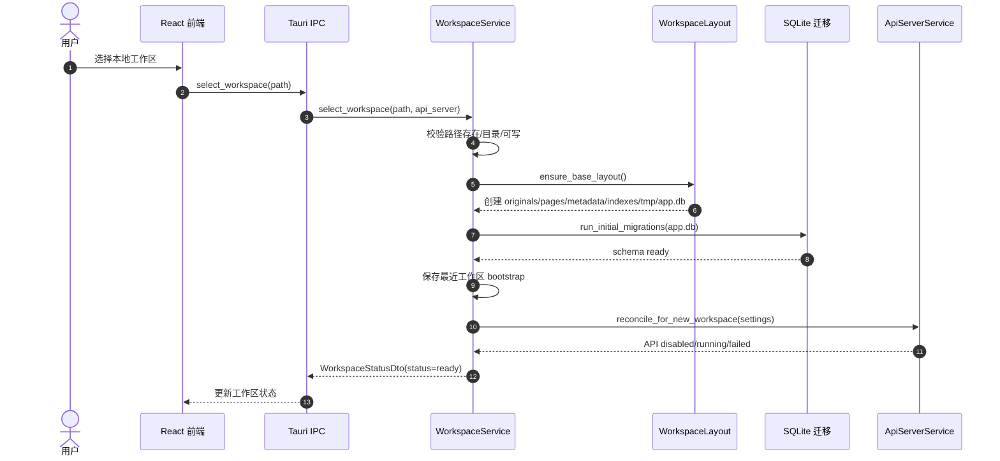
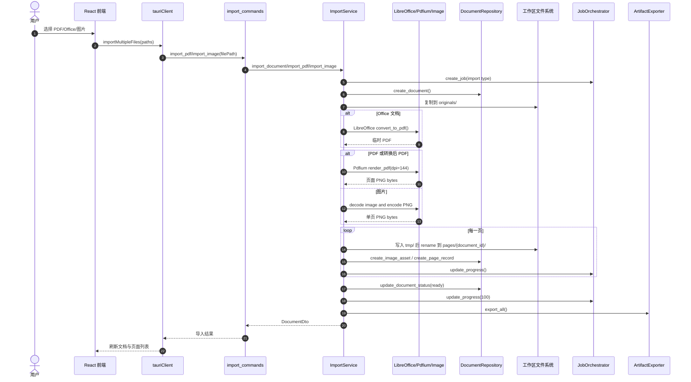
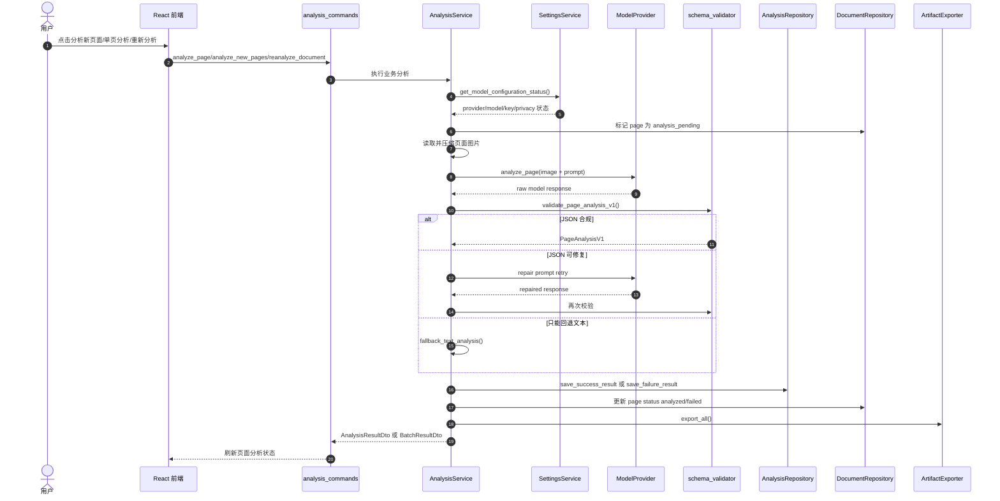
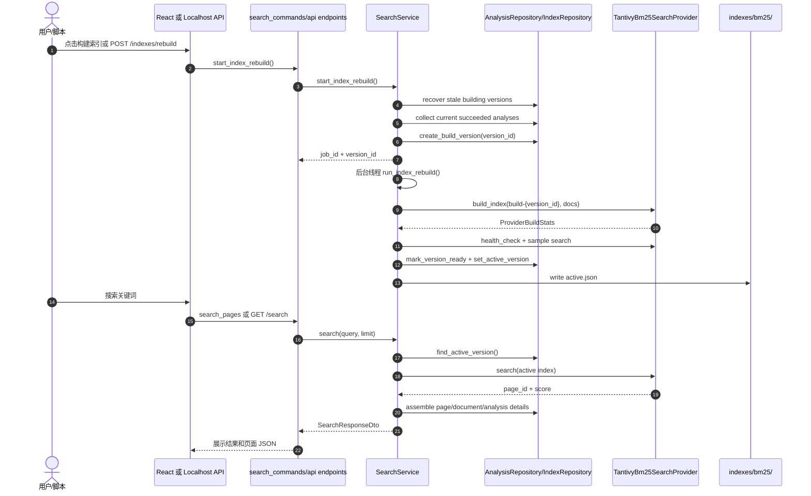
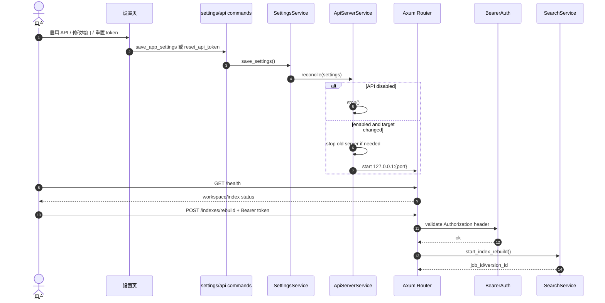

# SLICER 关键时序图

> 本文档包含可维护的 Mermaid 时序图，以及一份适合导入 Figma 继续美化的 SVG 视觉资产：[`assets/slicer-core-flows.svg`](./assets/slicer-core-flows.svg)。最后更新：2026-07-02。

## 1. 图形资产说明

- Mermaid 图用于文档维护、代码评审和快速理解。
- SVG 图是视觉化总览，适合直接拖入 Figma，或在浏览器中打开查看。
- 当前 Codex 会话未暴露可写的 Figma MCP 工具，因此未能直接在 Figma 文件中创建画板；已按 Figma 友好的分层、色彩和版式生成 SVG。

## 2. 工作区初始化

关键实现位置：

- `src-tauri/src/services/workspace_service.rs`
- `src-tauri/src/artifacts/workspace_layout.rs`
- `src-tauri/src/repositories/db.rs`
- `src-tauri/src/services/api_server_service.rs`

## 3. 文档导入与页面切片

关键实现位置：

- `src/lib/tauriClient.ts`
- `src-tauri/src/commands/import_commands.rs`
- `src-tauri/src/services/import_service.rs`
- `src-tauri/src/providers/pdf_renderer.rs`
- `src-tauri/src/providers/libreoffice_converter.rs`
- `src-tauri/src/artifacts/jsonl_exporter.rs`

## 4. 页面分析

关键实现位置：

- `src-tauri/src/services/analysis_service.rs`
- `src-tauri/src/providers/model/*_provider.rs`
- `src-tauri/src/providers/model/schema_validator.rs`
- `src-tauri/src/domain/analysis.rs`

## 5. 索引构建与搜索

关键实现位置：

- `src-tauri/src/services/search_service.rs`
- `src-tauri/src/providers/search/tantivy_bm25_provider.rs`
- `src-tauri/src/repositories/index_repository.rs`
- `src-tauri/src/api/endpoints.rs`

## 6. Localhost API 启停与认证

关键实现位置：

- `src-tauri/src/services/api_server_service.rs`
- `src-tauri/src/api/server.rs`
- `src-tauri/src/api/auth.rs`
- `src-tauri/src/commands/api_commands.rs`
- `src-tauri/src/commands/settings_commands.rs`

